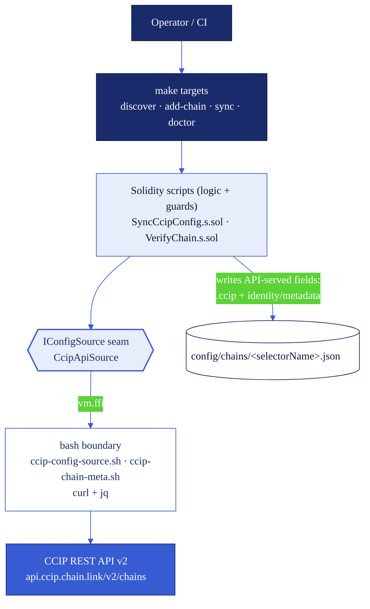
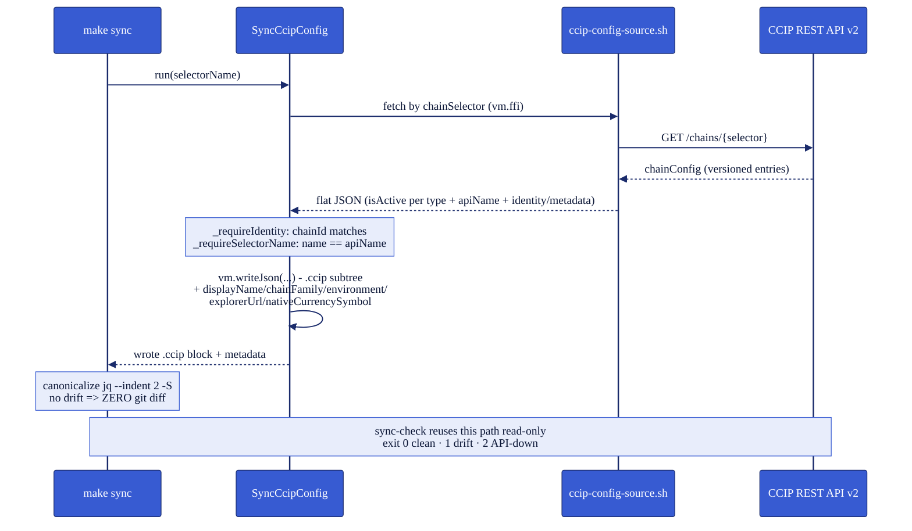
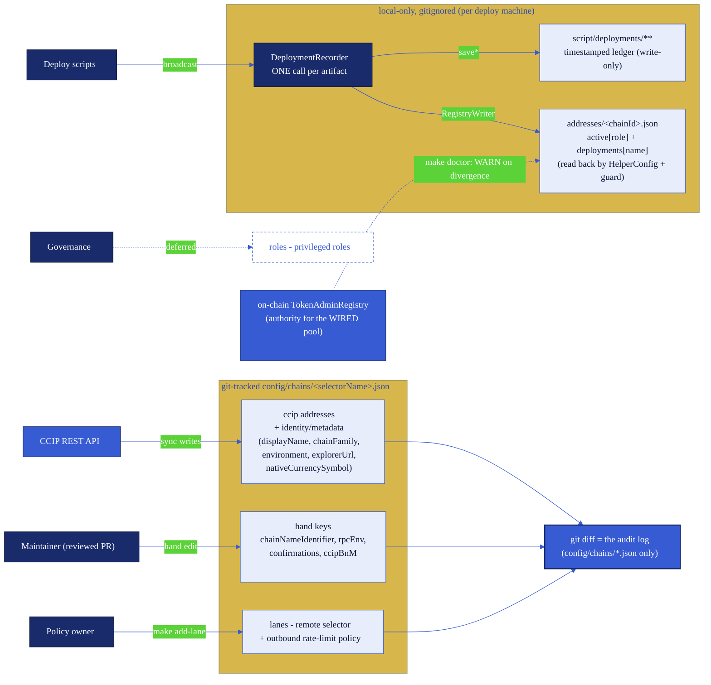
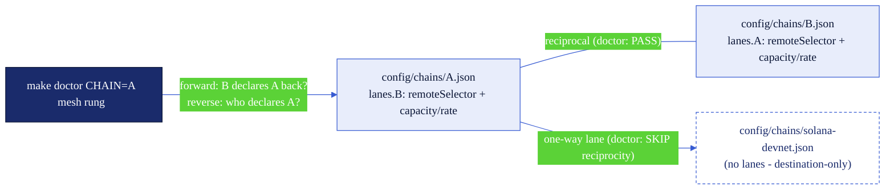
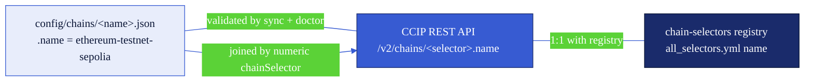

# Chain config architecture

How the chain-config infrastructure is wired: the `make` command surface, and the layered design that
keeps `config/chains/<selectorName>.json` true to the live CCIP REST API. For the per-field schema, see
**[`config-schema.md`](config-schema.md)**.

## Command reference

Every target is a thin wrapper defined in the repo [`Makefile`](../Makefile); the raw `forge script` /
`bash` command each runs is the escape hatch (also shown in the [README](../README.md#configuration)).
`FOUNDRY_PROFILE=sync` (which enables `ffi` for the `curl`+`jq` API fetch) is set **inside** the recipes
that need it, never exported. Targets that touch the API need only `curl` + `jq` - no RPC URL, no keystore.

| `make` target                         | Purpose                                                              | Args                          | Runs underneath                                                                 |
| ------------------------------------- | ------------------------------------------------------------------- | ----------------------------- | ------------------------------------------------------------------------------- |
| `help` (default)                      | List every target with its one-line purpose                         | -                             | `awk` over the `Makefile`                                                        |
| `tools`                               | Check `forge` / `curl` / `jq` are installed                         | -                             | `command -v` preflight                                                           |
| `discover`                            | List the CCIP API testnet catalog joined against local configs      | `FILTER=<term>` (optional)    | `bash script/config/sync-discover.sh`                                           |
| `add-chain`                           | Generate `config/chains/<CHAIN>.json` from the live API, then sync  | `CHAIN=` **+** `SELECTOR=` (both required) | `SyncCcipConfig.s.sol --sig "init(string,uint256)" <CHAIN> <SELECTOR>` → canonicalize |
| `add-lane`                            | Append a `lanes{}` policy entry LOCAL → REMOTE (writes **only** the `lanes` subtree; no API fetch) | `LOCAL=` `REMOTE=` `CAPACITY=` `RATE=` (all required); `INBOUND_CAPACITY=` + `INBOUND_RATE=` (paired, optional) add the `inbound{}` block; `BOTH=1` adds the reciprocal | `SyncCcipConfig.s.sol --sig "addLane(string,string,uint256,uint256)" <LOCAL> <REMOTE> <CAP> <RATE>` (6-arg overload with the inbound pair; twice with `BOTH=1`) → canonicalize both files |
| `remove-lane`                         | Remove a `lanes{}` policy entry LOCAL → REMOTE (undo of `add-lane`; writes **only** the `lanes` subtree, declaration only - an applied lane must also be removed on-chain via `ApplyChainUpdates`) | `LOCAL=` `REMOTE=` (both required); `BOTH=1` removes the reciprocal | `SyncCcipConfig.s.sol --sig "removeLane(string,string)" <LOCAL> <REMOTE>` (twice with `BOTH=1`) → canonicalize both files |
| `adopt-token`                         | Adopt an externally deployed token (and optionally its pool) into the address registry after on-chain validation (needs the chain's `rpcEnv` RPC; see [`enabling-existing-token.md`](enabling-existing-token.md)) | `CHAIN=` **+** `TOKEN=` (both required); `TOKEN_POOL=` optional | `AdoptToken.s.sol --sig "run(string,address,address)" <CHAIN> <TOKEN> <TOKEN_POOL or 0x0>` |
| `sync`                                | Refresh one chain's API-served fields (`ccip{}` + identity/metadata) from the API | `CHAIN=` (required) | `SyncCcipConfig.s.sol --sig "run(string)" <CHAIN>` → canonicalize                |
| `sync-preview`                        | Fetch + log a chain's `ccip{}` from the API **without writing**     | `CHAIN=` (required)           | `SyncCcipConfig.s.sol --sig "preview(string)" <CHAIN>`                           |
| `sync-all`                            | Refresh every configured chain (non-EVM SKIP; failures collected)   | -                             | loops `--sig "run(string)"` over `config/chains/*.json` + canonicalize each      |
| `sync-check`                          | Read-only drift check vs the live API (pass/fail via make)          | `CHAIN=` (optional)           | `bash script/config/sync-check.sh [<CHAIN>]` → `SyncCcipConfig --sig "check(string)"` |
| `doctor`                              | Layered single-chain verification (schema → API → RPC → on-chain → registry → mesh → lanes) | `CHAIN=` (required) | `VerifyChain.s.sol --tc VerifyChain --sig "run(string)" <CHAIN>`           |
| `fmt-config`                          | Rewrite `config/chains/*.json` in the canonical `jq --indent 2 -S` style | -                        | `jq` over every config file                                                      |

`CHAIN=` is always the chain's **canonical CCIP selectorName** (the file basename; validated against the
API - see [`config-schema.md`](config-schema.md#the-file-name-is-the-canonical-ccip-selectorname)).

**Which command when:** see the decision table in the
[README → Which command when](../README.md#which-command-when) (not duplicated here). In short: `discover`
to find a chain, `add-chain` to onboard it, `add-lane` to declare its lane policy, `adopt-token` to
bring externally deployed contracts into the address registry, `sync`/`sync-all` to apply the API's
current values, `sync-check` for the routine/CI drift verdict, and `doctor` for a deep single-chain
health check (including mesh reciprocity and on-chain lane reconciliation).

### Exit-code contract (drift check)

The canonical `0` clean / `1` drift / `2` API-unreachable contract belongs to
`bash script/config/sync-check.sh`. GNU make remaps any failing recipe to its own exit `2`, so
`make sync-check` is **pass/fail only** - CI and automation call the script directly to tell drift
(actionable) from an API flake (retry later). A scheduled workflow (`.github/workflows/config-drift.yml`)
runs it weekly: drift fails visibly, an unreachable API only warns.

## Architecture

### 1. Layering & responsibility split

The `make` UX front door delegates to Solidity scripts (all logic, guards, and chain access), which reach
the network only through a thin bash boundary (`curl`+`jq` over `ffi`). The `IConfigSource` interface is
the swap point: `CcipApiSource` is today's CCIP REST API v2 implementation, and a future API version is a
one-file change behind the same seam.

### 2. Sync data-flow

`make sync` fetches the per-chain config, selects the single `isActive` entry per contract type, validates
identity, then rewrites **every API-served field** - the `.ccip` subtree AND the API-served identity/metadata
(`displayName`, `chainFamily`, `environment`, `explorerUrl`, `nativeCurrencySymbol`) - and re-canonicalizes,
so a no-drift sync is a zero-diff no-op. The hand-authored keys (`chainNameIdentifier`, `rpcEnv`,
`confirmations`, `ccipBnM`) and the guarded join keys are left untouched.

### 3. One-writer-per-field store model

The **git-tracked** `config/chains/*.json` is a durable, versioned store; each field has exactly one writer,
so a git diff is an unambiguous audit artifact. **Everything the CCIP REST API serves is API-owned** - the
`ccip{}` addresses AND the identity/metadata fields (`displayName`, `chainFamily`, `environment`,
`explorerUrl`, `nativeCurrencySymbol`); the **`lanes{}` subtree is owner POLICY** (which remotes, at what
outbound rate limits), written by `make add-lane` and never by the sync; only the keys the API serves
nothing for (`chainNameIdentifier`, `rpcEnv`, `confirmations`, `ccipBnM`) are hand-authored; the join keys
(`name`/`chainSelector`/`chainId`) are seeded once and guard-validated. (The `roles` subtree below is the
general model - the governance-written privileged-role surface - and is deferred to a follow-up PR.)

**The deployed-address registry is separate and NOT git-tracked.** `addresses/<chainId>.json` is
**gitignored** and local to the machine that ran the deploy (a fresh clone / CI has none), so its history is
not a git audit trail. Its integrity comes instead from a **single writer**: each deploy script makes ONE
call to `script/utils/DeploymentRecorder.s.sol` per artifact, and that one call writes **both** stores it
touches - the detailed `script/deployments/**` ledger (via `DeploymentUtils.save*`, format unchanged) **and**
the registry (`deployments[name]` + `active[role]`, via `RegistryWriter`). Because one writer owns both, the
ledger and the registry cannot drift. The registry is the only address store read back (by `HelperConfig`
resolution and the redeploy guard); the ledger is write-only history. `active.<role>` records the
most-recently-deployed address, while the on-chain **TokenAdminRegistry** stays the authority for the wired
pool - `make doctor` reports any divergence as a WARN.

### 4. Lane reciprocity & the mesh

A lane is **directional policy**: `lanes.<remote>` in chain A's file declares "A's pool connects OUT to
`<remote>`" with an outbound rate limit. A working transfer path needs the lane declared on **both** files
(each side's `applyChainUpdates` reads its own file), so the committed configs must form a **reciprocal
mesh**. `make add-lane ... BOTH=1` writes both sides in one command, and `make remove-lane` is its undo
(declaration only - a lane still applied on the pool must be removed separately via
`ApplyChainUpdates`, and until then the doctor's lanes rung WARNs about the undeclared on-chain
lane); the doctor's **mesh rung** proves the property across the whole directory on every
`make doctor CHAIN=<name>`:

- **Resolution** - every `lanes.<remote>` key must resolve to an existing `config/chains/<remote>.json`
  (a dangling lane is a FAIL), and the entry's stored `remoteSelector` must equal that file's
  `chainSelector` (a mismatch is a FAIL - the lane was declared against a renamed or re-created chain).
- **Reciprocity, both directions** - a one-sided lane is a FAIL naming both chains, whichever side you
  doctor: A→B without B→A fails the doctor of **A** (forward check: does my remote declare me back?) and
  of **B** (reverse scan: which other configs declare lanes to me that I do not declare back?).
- **Non-EVM exemption** - non-EVM chains are destination-only here and carry no `lanes{}`, so a lane
  **to** e.g. `solana-devnet` is checked for resolution but exempt from reciprocity (a SKIP, not a FAIL).

The mesh rung proves the committed policy agrees with itself; the **lanes rung** (the doctor's last
rung) proves it agrees with the **chain**. It is RPC-gated like the TAR reconciliation (a clean SKIP
when the chain's `rpcEnv` is unset) and pool-gated (a SKIP naming `make adopt-token` / the deploy
scripts when no `tokenPool` is recorded in the registry). With a fork and a pool it resolves the pool's
contract version (`PoolVersion.tryResolve`; an unrecognized version WARNs and reads degrade to best
effort) and reconciles **both directions**:

- **Declared → on-chain** - every `lanes{}` entry must be applied on the pool
  (`isSupportedChain(remoteSelector)`; a missing lane WARNs naming `ApplyChainUpdates`), and the live
  rate-limit buckets must match the declared policy, read through the version-dispatched getter
  (`getCurrentOutboundRateLimiterState` on 1.5.0-1.6.1, `getCurrentRateLimiterState(selector, false)`
  on 2.0.0). Declared optional blocks are reconciled too: `inbound{}` against the inbound bucket, and
  the 2.0.0-only `v2{}` block (fast-finality buckets via `getCurrentRateLimiterState(selector, true)`,
  per-lane fee config via `getTokenTransferFeeConfig`) - declared against a pre-2.0.0 pool it WARNs
  naming the version mismatch. Undeclared blocks are never reconciled.
- **On-chain → declared** - every selector in the pool's `getSupportedChains()` (present on every
  cataloged version, 1.5.0 through 2.0.0) must have a `lanes{}` entry; an undeclared on-chain lane
  WARNs naming the `make add-lane` command (or `make add-chain` first when no config declares that
  selector).

Everything in the lanes rung is **WARN, never FAIL**: live drift can be a deliberate emergency
throttle, and an on-chain lane added out-of-band is an operator decision to surface, not a config
error to block on. The rung never hard-reverts on a non-standard pool - every read goes through the
doctor's probe and degrades to a WARN or SKIP. Coverage: `test/config/VerifyChainLaneReconcile.t.sol`
(fork + offline mock tests, including the 1.5.0 version-dispatch path) and the RPC-gated SKIP case in
`script/config/test-tooling.sh`.

The declaration is not just verified - it is **consumed**, by four scripts sharing one input ladder
(matching the repo's `inline > env > registry` idiom): **env vars win** when set (byte-for-byte the
historical behavior - the explicit override for incident response), otherwise the value comes from the
**declared `lanes{}` entry** in the local chain config (matched by the remote's config name, falling
back to `remoteSelector` equality), and with neither the historical default stands.

- **`ApplyChainUpdates`** (CLI mode) resolves its rate-limit buckets per direction: `capacity`/`rate`
  drive the outbound bucket, enabled iff either is non-zero - the same inference the lanes rung uses -
  and the optional `inbound{}` block drives the inbound bucket. With neither source, the buckets stay
  disabled (the historical default).
- **`UpdateRateLimiters`** applies the same ladder per direction, scoped to the bucket it writes: the
  standard bucket consumes the same core fields as `ApplyChainUpdates`; with `FAST_FINALITY=true` on a
  2.0.0 pool it consumes `v2.fastFinality.outbound` / `v2.fastFinality.inbound` instead (each direction
  declared only when its block exists). A direction with neither source stays untouched, and a run
  where neither direction has any source keeps the historical error - now naming both remedies.
- **`UpdateTokenTransferFeeConfig`** resolves each of the six fee fields through the ladder: env var >
  declared `v2.feeConfig.<field>` > the current on-chain value (its historical per-field default).
- **`UpdateCCVConfig`** resolves each of the four per-lane verifier arrays through the ladder (env var >
  declared `v2.ccv.<field>` > current on-chain), plus the pool-global threshold (env var >
  chain-level `ccvThreshold` > current). Because `applyCCVConfigUpdates` replaces a lane's whole entry,
  the read-modify-write is load-bearing: an undeclared array carries its current on-chain value, so
  setting one array never clears the others. The CCV surface lives on the pool's `AdvancedPoolHooks`
  contract, so the script (and the doctor's CCV reconcile) resolve it via `getAdvancedPoolHooks()`;
  divergence is compared as a set (order-insensitive).

The loop stays owner-controlled: an apply **never writes `lanes{}` back**. An env-override apply that
leaves the declaration missing or diverging prints a divergence notice plus a remediation hint with the
values just applied - the exact `make add-lane` command for the core fields, a hand-edit instruction for
the v2 blocks (`add-lane` has no flag surface for them, deliberately) - and the doctor WARNs until the
declaration is reconciled through a reviewed edit. Coverage: `test/setup/ApplyChainUpdatesLaneSource.t.sol`,
`test/configure/UpdateRateLimitersLaneSource.t.sol`,
`test/configure/UpdateTokenTransferFeeConfigLaneSource.t.sol`, and
`test/configure/UpdateCCVConfigLaneSource.t.sol`. The doctor reconciles the same v2 surfaces on-chain
(`test/config/VerifyChainLaneReconcile.t.sol`, `test/config/VerifyChainCCVReconcile.t.sol`).

### 5. The selectorName join

The config `name`, the CCIP REST API `name`, and the `chain-selectors` registry `name` are the **same
canonical selectorName** - the human-readable key tying the local store to the API and the source-of-truth
registry (the numeric `chainSelector` is the immutable machine join key they all also share).

## Related

- **[`config-schema.md`](config-schema.md)** - the per-field reference for a chain config file.
- **[`deployed-addresses.md`](deployed-addresses.md)** - the two deployed-address stores (the append-only
  `script/deployments/` history vs the machine-read `addresses/<chainId>.json` registry), how one recorder
  call emits both, the resolution ladder, and the doctor's TAR reconciliation.
- [README → Configuration](../README.md#configuration) · [README → Adding a New Chain](../README.md#adding-a-new-chain).
