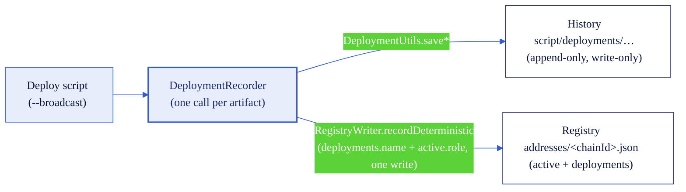

# Deployed-address stores

Every deploy in this repo records its output in **two files**. They are not two sources of truth - they are
**two views of a single write**. Understanding which store answers which question keeps you from trusting the
wrong one.

- **History** - `script/deployments/<category>/<CHAIN>/<timestamp>-<symbol>-<type>.json`
  An append-only, timestamped log. One file per deploy, forever. **Write-only: nothing in this repo reads it
  back.** It exists as a human-readable deploy diary.
- **Registry** - `addresses/<chainId>.json`
  The current-state, machine-read store. This is the **only** store that resolution
  (`HelperConfig.getDeployed*`), the redeploy guard (`RegistryWriter.guardRedeploy`), and the doctor
  (`make doctor` / `VerifyChain`) consult.

| Question | Store that answers it |
| --- | --- |
| "What is the current token/pool/lockbox/hooks address for this chain?" | Registry (`addresses/<chainId>.json` → `active.<role>`) |
| "Does an artifact with this exact type+version key already exist?" (redeploy guard) | Registry (`deployments.<name>`) |
| "Is the registry pool the one CCIP actually routes through?" | `make doctor` reads the on-chain **TokenAdminRegistry**, not either file |
| "When did each deploy happen, in order?" | History (`script/deployments/…`) |
| "What did later scripts resolve with zero `export`?" | Registry only - the history is never read |

Both stores are **gitignored** (`.gitignore`: `script/deployments/` and `addresses/*.json`, with a single
committed sample `addresses/11155111.example.json`). Only `config/chains/*.json` is git-tracked, so **only the
chain config has a git audit trail** - the deployed-address stores do not.

## One recorder call emits both (the anti-drift property)

Each deploy script makes **one** call to `script/utils/DeploymentRecorder.s.sol` per artifact. That single
call writes the history file (via `DeploymentUtils.save*`) **and** upserts the registry (via
`RegistryWriter.recordDeterministic`, which sets the `deployments.<name>` entry and the `active.<role>`
pointer in one file write). Because both stores flow from the same call, they cannot drift apart.



## Registry schema v2: `active` vs `deployments`

```jsonc
{
  "active": {                        // single per-role pointer HelperConfig resolves (zero-export)
    "token":     "0xToken",
    "tokenPool": "0xPoolV2",         // the most-recently-deployed pool for this chain
    "lockBox":   "0xLockBox",
    "poolHooks": "0xHooks"
  },
  "deployments": {                   // uniquely named per artifact; the key carries type + version
    "BnM-T_Token":                   "0xToken",
    "BnM-T_BurnMintTokenPool_2.0.0": "0xPoolV2",
    "BnM-T_LockBox":                 "0xLockBox",
    "BnM-T_BurnMint_PoolHooks":      "0xHooks"
  }
}
```

Per-artifact keys (`DeploymentRecorder`):

| Artifact | `deployments` key | `active` role |
| --- | --- | --- |
| Token | `{symbol}_Token` | `token` |
| Token pool | `{symbol}_{poolType}TokenPool_{version}` | `tokenPool` |
| LockBox | `{symbol}_LockBox` | `lockBox` |
| Pool hooks | `{symbol}_{poolType}_PoolHooks` | `poolHooks` |

The pool key includes the pool's **type and version** purely so distinct artifacts never collide in storage.
This is a mechanical keying property, not a migration workflow: the deploy scripts pin the version
(`DeploymentRecorder.POOL_VERSION` = `"2.0.0"`), so `poolName()` only ever emits the `_2.0.0` key. Deploying
the same symbol + pool type again produces the same key, which trips the guard.

## The redeploy guard and `FORCE_REDEPLOY`

Before a deploy, `RegistryWriter.guardRedeploy` checks whether the `deployments.<name>` key already resolves
to a non-zero address. If it does, the script **refuses to run** and prints the registered address. Set
`FORCE_REDEPLOY=true` to deploy a replacement of the same name: the stale `deployments` entry (and any
`active` pointer at that address) is dropped, and the new deploy records the replacement. The prior address
**stays in the append-only history ledger** under `script/deployments/`. It does **not** stay in git history -
the registry is gitignored.

## Resolution ladder (per role)

`HelperConfig.getDeployed{Token,TokenPool,LockBox,PoolHooks}` resolves each role in this order:

1. **Inline alias** - `TOKEN` / `TOKEN_POOL` / `LOCK_BOX` / `POOL_HOOKS` (chain-agnostic, highest priority)
2. **Chain-scoped env** - `{CHAIN}_TOKEN`, `{CHAIN}_LOCK_BOX`, … (e.g. `ETHEREUM_SEPOLIA_LOCK_BOX`)
3. **Registry** - `addresses/<chainId>.json` → `active.<role>`
4. Otherwise `address(0)`

**Single-valued limit (be honest about it).** `active.<role>` holds exactly one address per role, and the
zero-export getters read only `active` (never `deployments`). Deploy two tokens/pools for the same chain and
`active.tokenPool` points at the **last** one deployed; the zero-export path then resolves that same pool for
both tokens. This is a limit of the *resolution* layer, not the *storage* layer - both artifacts are still
distinct entries under `deployments`. To target the earlier one, pass it explicitly via an inline alias or a
`{CHAIN}_` env var, or read its `deployments.<name>` entry.

## The doctor's TAR reconciliation rung

`make doctor CHAIN=<name>` (`VerifyChain`) reconciles the registry's `active.tokenPool` against the pool
actually wired in the on-chain **TokenAdminRegistry** (`getPool(token)`):

- **PASS** when the registry pool == the wired pool.
- **WARN** (never FAIL) when they diverge - the wired pool was changed out-of-band, or the registry pointer is
  stale.
- **WARN** when the token has no pool registered in the TAR.

It is always a WARN because the registry is *local bookkeeping of what this repo deployed*, while the TAR is
*what CCIP routes through*; they can legitimately differ.

## Authority boundary

The on-chain **TokenAdminRegistry is the source of truth** for what is wired. The `addresses/<chainId>.json`
registry is local bookkeeping - "what this repo deployed most recently" - not an authority for what CCIP uses.
Because both deployed-address stores are gitignored, neither carries a git audit trail; only `config/chains/*.json`
(git-tracked) does. When in doubt about wiring, read the TAR (or run `make doctor`), never the registry file.

## One format note (unchanged by this work)

The hooks **history** filename carries no symbol or pool type - it is
`script/deployments/advanced-pool-hooks/<CHAIN>/<timestamp>-AdvancedPoolHooks.json`. The hooks **registry** key
is finer-grained (`{symbol}_{poolType}_PoolHooks`). This asymmetry is pre-existing; we did not change the
history file format.

## Related

- [`config-schema.md`](config-schema.md) - the registry schema in the wider config-file reference.
- [`config-architecture.md`](config-architecture.md) - the one-writer-per-field store model and the sync tooling.
- [README → Deployed-address registry](../README.md#deployed-address-registry--addresseschainidjson-the-default)
  and [README → Sharing addresses with your team](../README.md#sharing-addresses-with-your-team).
