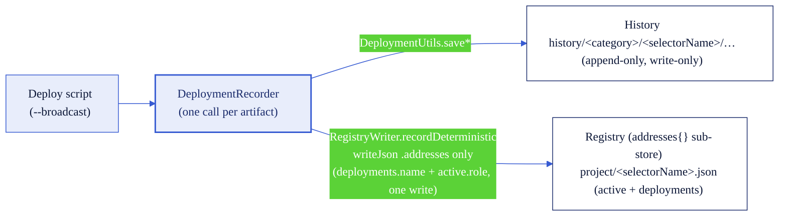

# Deployed addresses: the project store

Every deploy in this repo records its output in **two files**. They are not two sources of truth - they are
**two views of a single write**. Knowing which store answers which question keeps you from trusting the
wrong one.

- **Project store** - `project/<selectorName>.json`
  The current-state, machine-read store. One file per chain, keyed by the canonical CCIP **selectorName**
  (the `config/chains` basename). It holds three subtrees - `addresses{}`, `lanes{}`, `roles{}` - plus a
  top-level `"schema": 3`. Deployed addresses live in the **`addresses{}`** subtree, and that subtree is the
  **only** store resolution (`HelperConfig.getDeployed*`), the redeploy guard (`RegistryWriter.guardRedeploy`),
  and the doctor (`make doctor` / `VerifyChain`) read back.
- **History** - `history/<category>/<selectorName>/<timestamp>-<symbol>-<type>.json`
  An append-only, timestamped log. One file per deploy, forever. **Write-only: nothing in this repo reads it
  back.** It is a human-readable deploy diary.

## The word "registry" means the addresses sub-store, not the file

Two terms, kept distinct throughout these docs:

- **Project store** = the whole `project/<selectorName>.json` file (all three subtrees + schema).
- **Registry** / **`RegistryWriter`** = the **`addresses{}` sub-store** inside it. The word is reserved for
  that subtree only. `lanes{}` (owner policy) and `roles{}` (authority) are the store's other two subtrees,
  each with its own writer, documented in [`config-schema.md`](config-schema.md) and
  [`roles.md`](roles.md).

## The address loop: who writes, overrides, reconciles, warns

`addresses{}` has a small, closed set of participants. This is the whole loop:

| Participant                            | Role                     | What it does                                                                                                                                                        |
| -------------------------------------- | ------------------------ | ------------------------------------------------------------------------------------------------------------------------------------------------------------------- |
| Deploy scripts (`--broadcast`)         | **Writer**               | Record each artifact via one `DeploymentRecorder` call → `history/` file + `addresses{}` entry                                                                      |
| `make adopt-token`                     | **Writer / reconciler**  | Bring an externally deployed token/pool into `addresses{}` after on-chain validation; also the tool that repoints `active.<role>` to reconcile the store to reality |
| Env vars (`{CHAIN}_TOKEN`, `TOKEN`, …) | **Override (READ-ONLY)** | Win over `addresses.active.<role>` at resolution time only                                                                                                          |
| Run-time divergence notice             | **Warner**               | When an env override differs from `active.<role>`, a broadcasting script prints both values + the exact `make adopt-token …` to reconcile                           |
| `make doctor` TAR rung                 | **Warner**               | Compares `active.tokenPool` against the on-chain TokenAdminRegistry and WARNs on divergence                                                                         |
| `make doctor` registry rung            | **Warner**               | WARNs when `deployments{}` holds more than one token pool while `active.tokenPool` points at one (the multi-token ambiguity), naming a token `GROUP=<g>` as the durable fix and the `{CHAIN}_TOKEN_POOL` override as the one-off |
| `make doctor` roles rung               | **Warner**               | WARNs when a `roles.token/pool.address` anchor diverges from `addresses.active.<role>` (a repoint after the snapshot) - re-anchor with `make snapshot-chain`        |

**Env overrides are READ-ONLY inputs: an env-driven run never writes the store.** An override changes only
what a single run resolves; to make a value the durable default, adopt it (`make adopt-token`). The
divergence notice exists to close exactly that gap - it names the env value, the stored value, and the
`make adopt-token` command that reconciles them.

## One recorder call emits both stores (the anti-drift property)

Each deploy script makes **one** call to `script/utils/DeploymentRecorder.s.sol` per artifact. That single
call writes the `history/` file (via `DeploymentUtils.save*`) **and** upserts the registry (via
`RegistryWriter.recordDeterministic`, which sets the `deployments.<name>` entry and the `active.<role>`
pointer in one write to the `.addresses` subtree). Because both stores flow from the same call, they cannot
drift apart. `RegistryWriter` writes **only** `.addresses` (`vm.writeJson(json, path, ".addresses")`, never
`writeFile`), so a deploy leaves `lanes{}` and `roles{}` byte-identical.

The diagram below shows one deploy fanning out to the two views. Solidity blue is the writer seam; the two
stores are the leaves.



## The `addresses{}` sub-store: `active` vs `deployments`

Values are **strings**: EVM hex for EVM chains, base58 for non-EVM (Solana) chains, family-validated on
write.

```jsonc
{
  "active": {
    // single per-role pointer HelperConfig resolves (zero-export)
    "token": "0xToken",
    "tokenPool": "0xPoolV2", // the most-recently-deployed pool for this chain
    "lockBox": "0xLockBox",
    "poolHooks": "0xHooks"
  },
  "deployments": {
    // uniquely named per artifact; the key carries type + version
    "BnM-T_Token": "0xToken",
    "BnM-T_BurnMintTokenPool_2.0.0": "0xPoolV2",
    "BnM-T_LockBox": "0xLockBox",
    "BnM-T_BurnMint_PoolHooks": "0xHooks"
  }
}
```

Per-artifact keys (`DeploymentRecorder`):

| Artifact   | `deployments` key                        | `active` role |
| ---------- | ---------------------------------------- | ------------- |
| Token      | `{symbol}_Token`                         | `token`       |
| Token pool | `{symbol}_{poolType}TokenPool_{version}` | `tokenPool`   |
| LockBox    | `{symbol}_LockBox`                       | `lockBox`     |
| Pool hooks | `{symbol}_{poolType}_PoolHooks`          | `poolHooks`   |

The pool key includes the pool's **type and version** so distinct artifacts never collide in storage. This
is a mechanical keying property, not a migration workflow: the deploy scripts pin the version
(`DeploymentRecorder.POOL_VERSION` = `"2.0.0"`), so `poolName()` only ever emits the `_2.0.0` key. Deploying
the same symbol + pool type again produces the same key, which trips the guard.

## The redeploy guard and `FORCE_REDEPLOY`

Before a deploy, `RegistryWriter.guardRedeploy` checks whether the `deployments.<name>` key already resolves
to a non-zero address. If it does, the script **refuses to run** and prints the registered address. Set
`FORCE_REDEPLOY=true` to deploy a replacement of the same name: the stale `deployments` entry (and any
`active` pointer at that address) is dropped, and the new deploy records the replacement. The prior address
**stays in the append-only `history/` ledger**. It does **not** stay in git history when the template
gitignores `project/` (see [Tracking rule](#tracking-rule-template-vs-fork)).

## Resolution ladder (per role)

`HelperConfig.getDeployed{Token,TokenPool,LockBox,PoolHooks}` resolves each EVM role in this order:

1. **Inline alias** - `TOKEN` / `TOKEN_POOL` / `LOCK_BOX` / `POOL_HOOKS` (chain-agnostic, highest priority)
2. **Chain-scoped env** - `{CHAIN}_TOKEN`, `{CHAIN}_LOCK_BOX`, … (e.g. `ETHEREUM_SEPOLIA_LOCK_BOX`)
3. **Registry** - `project/[<group>/]<selectorName>.json` → `addresses.active.<role>`
4. Otherwise `address(0)`

Non-EVM roles resolve through the string-typed getters (`getDeployedTokenString` /
`getDeployedTokenPoolString`, chain-scoped env > store), because base58 does not fit an `address`.

**Single-valued limit, and the durable fix (token groups).** `active.<role>` holds exactly one address per
role, and the zero-export getters read only `active` (never `deployments`). Deploy two tokens/pools for the
same chain in **one** group and `active.tokenPool` points at the **last** one deployed; the zero-export path
then resolves that same pool for both tokens. This is a limit of the _resolution_ layer, not the _storage_
layer - both artifacts are still distinct entries under `deployments`.

The durable fix is to give each token its own **token group**: run the second token's commands under
`GROUP=<name>` so its state lives in `project/<name>/<selectorName>.json`, isolated from the first token's
default-group file. The config-layer commands take `GROUP=<name>`; the second token's **deploy** is a raw
`forge script` with no make wrapper, so it is the first grouped step and takes `PROJECT_GROUP=<name>`
directly (e.g. `PROJECT_GROUP=<name> forge script script/deploy/DeployToken.s.sol ...`, the pool deploy
likewise). Each group has its own single-valued `active.<role>`, so there is no contention (see
[`config-schema.md`](config-schema.md#the-project-store---projectselectornamejson)). For a one-off against
the earlier artifact within a group, pass it explicitly via an inline alias or a `{CHAIN}_` env var, or read
its `deployments.<name>` entry.

**Digit-leading `{CHAIN}_` prefixes cannot live in `.env`.** The bundled `0g-testnet-galileo-1` carries
`chainNameIdentifier: 0G_GALILEO_TESTNET`, so its override vars (`0G_GALILEO_TESTNET_TOKEN`,
`0G_GALILEO_TESTNET_TOKEN_POOL`, ...) are digit-leading - not valid shell identifiers: `export 0G_...=` is
refused, and forge's `.env` autoload silently stops parsing the file at the first digit-leading key
(silently dropping every later line). Pass such overrides inline via `env` instead:
`env '0G_GALILEO_TESTNET_TOKEN_POOL=0x...' forge script ...` (its `rpcEnv` is the shell-safe
`ZERO_G_TESTNET_RPC_URL` and belongs in `.env` as usual). This is specific to the bundled
`0g-testnet-galileo-1`, frozen before the auto-fix existed: a NEW digit-leading chain has `add-chain`
prefix a `_` (so `_0G_TESTNET_GALILEO_1`, a valid shell identifier), and the doctor WARNs on a
non-exportable `rpcEnv`. Override any derived name up front via `CHAIN_NAME_IDENTIFIER=` at `add-chain` time.

**Env overrides are group-agnostic.** Steps 1-2 of the ladder sit **above** the group-scoped registry, so an
exported `{CHAIN}_TOKEN` / inline `TOKEN=` wins over **every** group's `active.<role>` at once. With two
groups live, an override set for one group also resolves into the other - unset it between groups so a
group-specific override never cross-contaminates.

## The doctor's TAR reconciliation rung

`make doctor CHAIN=<name>` (`VerifyChain`) reconciles the registry's `active.tokenPool` against the pool
actually wired in the on-chain **TokenAdminRegistry** (`getPool(token)`):

- **PASS** when the registry pool == the wired pool.
- **WARN** (never FAIL) when they diverge - the wired pool was changed out-of-band, or the registry pointer is
  stale.
- **WARN** when the token has no pool registered in the TAR.

It is always a WARN because the registry is _local bookkeeping of what this repo deployed_, while the TAR is
_what CCIP routes through_; they can legitimately differ.

## Authority boundary

The on-chain **TokenAdminRegistry is the source of truth** for what is wired. The registry
(`addresses.active` in the project store) is local bookkeeping - "what this repo deployed most recently" -
not an authority for what CCIP uses. When in doubt about wiring, read the TAR (or run `make doctor`), never
the store file.

## Tracking rule: template vs fork

The audit surface is **`config/chains/*.json` (always git-tracked) + a fork's tracked `project/`**. The two
stores are governed differently by design:

- **This template repo gitignores `project/`.** It ships no real deployment addresses - only the concrete
  example `project/ethereum-testnet-sepolia.example.json`. `history/` is gitignored too. So in the template,
  `config/chains` is the only git audit trail; the address stores are local to the machine that ran the
  deploy (a fresh clone or CI has none).
- **A downstream fork should UN-gitignore `project/`** to make its own lanes, roles, and deployed addresses
  one reviewed, git-versioned, team-shared source of truth. Track **public** data only - addresses plus
  reviewed policy and authority - **never secrets** (no RPC URLs, no keys; a lint FAILs a secret-shaped
  value). A tracked `project/` then joins `config/chains` as an audit surface: a git diff shows who changed
  which lane, role, or address.

`history/` stays gitignored in both cases (append-only local diary). See
[`config-schema.md`](config-schema.md) for the per-store canonical JSON form (`project/` files carry no
trailing newline; `config/chains` files do).

## Verified source is part of the address record

Wherever a deployed address is published for people to act on (a fork's tracked `project/`, a team
runbook, a PR description), record the **verified** explorer URL next to it, at the same evidence bar as
a tx hash: the link must show verified source, not just an address page. The verification workflow (the
inline `--verify`, the standalone backfill, and the per-chain backends) is in
[operations: verification](operations/verification.md).

## Related

- [`config-schema.md`](config-schema.md) - the project store schema (all three subtrees) and the
  config/chains field reference.
- [`config-architecture.md`](config-architecture.md) - the one-writer-per-subtree store model and the sync
  tooling.
- [config schema: the project store](config-schema.md#the-project-store---projectselectornamejson)
  and [the store model](concepts/store-model.md).