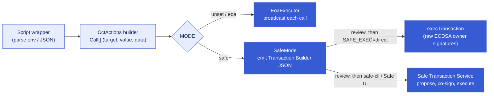

# Governance modes

Every write operation in this repo is defined once, as a `CctActions` builder that returns a
`Call[]` (target, value, calldata). The `MODE` environment variable selects which executor runs
that `Call[]`. The calldata is identical in every mode, so reviewing one mode reviews them all.

| Mode          | Executor                  | What happens                                                                                                                                         |
| ------------- | ------------------------- | ---------------------------------------------------------------------------------------------------------------------------------------------------- |
| unset / `eoa` | `EoaExecutor` (broadcast) | Each call is broadcast from the script signer.                                                                                                       |
| `safe`        | `SafeMode`                | The batch is written as Safe Transaction Builder JSON under `batches/` for review and signing; optionally executed directly with `SAFE_EXEC=direct`. |

A user who never sets `MODE` sees no change and needs no new environment variables: same commands,
same flags, same broadcast behavior, same output. The Safe-mode variables below are read only when
`MODE=safe`.

A [Safe](https://docs.safe.global/) is an on-chain multisig: `threshold`-of-owners signatures
authorize each Safe transaction, and the Safe serializes its transactions with its own nonce,
distinct from any account nonce.



## Deploying a Safe

`script/governance/DeploySafe.s.sol` deploys from the canonical Safe v1.4.1 stack:

```bash
SAFE_OWNERS="0x...,0x...,0x..." SAFE_THRESHOLD=2 \
forge script script/governance/DeploySafe.s.sol --rpc-url $ETHEREUM_SEPOLIA_RPC_URL --broadcast
```

`SafeProxyFactory.createProxyWithNonce(SafeL2, setup(...), saltNonce)` is CREATE2, and the factory,
singleton, and fallback handler live at the same address on every supported chain. The same owners,
threshold, and salt nonce therefore reproduce the same Safe address on every chain, which is what a
mirrored multi-chain fleet needs. The script predicts the address first, asserts the deployment
lands on it, and is idempotent when the Safe already exists.

`SAFE_SALT_NONCE` (optional, default 0) is the CREATE2 salt nonce; reuse the same value on every
chain to mirror the address. The script requires the canonical v1.4.1 factory and singleton to have
code on the target chain and reverts otherwise (0G Galileo, for example, does not carry the
canonical stack).

The repo pins v1.4.1 rather than v1.5.0 because v1.5.0's canonical rollout is incomplete: as of
2026-07-10 the v1.5.0 `SafeL2` singleton is not deployed on Avalanche Fuji, among others, so
v1.4.1 is the only stack that mirrors one fleet address on every supported chain.
`test/governance/Safe150Compat.t.sol` proves the mode is forward-compatible: the `safeTxHash`
math, the `execTransaction` ABI, and MultiSend batching all hold against a Safe deployed from the
canonical v1.5.0 stack, so adopting v1.5.0 later is a constants change in `SafeCanonical`, not a
redesign.

**After the roles handoff** ([roles.md → the ceremony](roles.md#the-eoa--safe-handoff-ceremony)) the
Safe holds every privileged role, so every owner- or admin-gated command from that point on runs with
`MODE=safe SAFE_ADDRESS=<safe>` - an EOA-mode run fails its authority preflight, by design. Read-only
commands (`roles-check`, `doctor`, getters) are unaffected.

## Safe mode environment variables

Read only when `MODE=safe`:

| Variable           | Required               | Meaning                                                                                                                                             |
| ------------------ | ---------------------- | --------------------------------------------------------------------------------------------------------------------------------------------------- |
| `SAFE_ADDRESS`     | yes                    | The Safe that owns or administers the target contracts. Preflight authority checks compare against this address instead of the script broadcaster. |
| `BATCH_NAME`       | no (`cct-batch`)       | Basename of the emitted file: `batches/<BATCH_NAME>.<chainId>.json`.                                                                                |
| `SAFE_EXEC`        | no                     | Unset: emit the batch only. `direct`: execute `execTransaction` in the same run.                                                                    |
| `SAFE_SIGNER_KEYS` | for `SAFE_EXEC=direct` | Comma-separated owner private keys, at least `threshold` of them. Never logged.                                                                     |

Preflight checks that assert on-chain authority (pool owner, pending administrator, admin role)
compare against the account that will execute the calls: the Safe in `safe` mode, the script
broadcaster otherwise (`EoaExecutor.executingAccount()`). `SAFE_ADDRESS` is therefore read at
preflight time, before any batch is emitted, and an emit-only run fails without it. Example:
`AcceptAdminRole` with `MODE=safe` requires the Safe, not the broadcaster, to be the registry's
pending administrator, so it runs standalone in Safe mode once the Safe is pending.

## The two Safe paths

Both paths execute the same reviewed batch and produce a byte-identical on-chain effect. They
differ only in how signatures are collected.

**Direct `execTransaction` (universal).** `SAFE_EXEC=direct` computes the `safeTxHash` (see
[`safeTxHash` mechanics](#safetxhash-mechanics)), signs it with the provided owner keys, packs the
signatures sorted ascending by signer address, and submits `execTransaction` from the script
signer. The submitting account pays gas but does not need to be a Safe owner; authorization comes
entirely from the packed owner signatures. This path works on any EVM chain because it needs
nothing but the Safe contract itself. It is the default for automated tests and the only option on
chains the Safe Transaction Service does not serve.

**Safe Transaction Service (network-dependent).** The emitted `batches/<name>.<chainId>.json`
imports directly into the Safe{Wallet} UI's Transaction Builder, or can be proposed from the
command line with the official Python [`safe-cli`](https://github.com/safe-global/safe-cli):
propose, co-sign to threshold, execute. The proposal appears in the Safe{Wallet} queue, which is
where production co-signing usually happens. This path requires the Transaction Service to serve
the network (matrix below). One caveat from live validation: safe-cli 1.9.0's `execute` underprices
EIP-1559 gas on Sepolia (`max fee per gas less than block base fee`). Execution of a fully signed
proposal is permissionless, so the fallback stays on the Transaction Service path: fetch the
proposal's collected confirmations from the service, pack them sorted ascending by owner address,
and submit `execTransaction` from any funded account. The service's `isExecuted` flag lags the
receipt by up to a minute; poll before asserting.

## Review before submitting

The security gate is the same on both paths, and it happens before any signature is produced:

1. Decode every transaction in the emitted batch file and check `to`, `value`, the function
   selector, and the decoded arguments against the operation you intend. The batch carries exactly
   the calldata EOA mode would broadcast, so the comparison is direct
   (`test/governance/SafeMode.t.sol` pins this byte for byte).
2. Verify the `safeTxHash` independently before co-signing. On the `SAFE_EXEC=direct` path,
   `SafeMode` recomputes the EIP-712 hash locally and requires it to equal the Safe's on-chain
   `getTransactionHash` before signing. On the Transaction Service path no local recompute runs, so
   each co-signer performs the equivalent check on their own device (see
   [Independent signature verification](#independent-signature-verification)) and withholds the
   signature until the hash matches.

## `safeTxHash` mechanics

The hash the owners sign is EIP-712 over the Safe's domain and the SafeTx struct
(`src/base/SafeTxHash.sol`):

- Domain separator: `keccak256("EIP712Domain(uint256 chainId,address verifyingContract)")` with the
  chain id and the Safe address (Safe >= 1.3.0).
- `SAFE_TX_TYPEHASH = keccak256("SafeTx(address to,uint256 value,bytes data,uint8 operation,uint256 safeTxGas,uint256 baseGas,uint256 gasPrice,address gasToken,address refundReceiver,uint256 nonce)")`
  = `0xbb8310d486368db6bd6f849402fdd73ad53d316b5a4b2644ad6efe0f941286d8`.
- The type string ends in `uint256 nonce`, the EIP-712 struct field name. Encoding `_nonce`, the
  Solidity parameter name Safe's own `getTransactionHash` uses, yields a wrong typehash and a hash
  that never matches signer devices. `test/governance/SafeTxHash.t.sol` pins this as a regression
  test, and fuzzes the local recompute against a real Safe's `getTransactionHash` on a fork.
- Signing uses raw ECDSA signatures (v = 27/28) over that hash, concatenated sorted ascending by
  signer address. The Safe rejects unsorted packs (`GS026`).

A single-call batch is submitted as a plain CALL (`operation = 0`) to its target. A batch of more
than one call becomes a single DELEGATECALL (`operation = 1`) into the canonical
`MultiSendCallOnly`, which replays each inner CALL from the Safe. A reviewer therefore accepts
`operation = 1` only when `to` is exactly the canonical `MultiSendCallOnly` address.

## Independent signature verification

Each signer recomputes the `safeTxHash` on a separate device before signing. The recompute takes
only the announced primary inputs: chain id, Safe address and version, `to`, `value`, `data`,
`operation`, and `nonce`. All of them are visible in the batch file, the Safe{Wallet} queue, or
the `SafeMode` run log, and the nonce is readable on-chain (`cast call $SAFE "nonce()(uint256)"`).
The signer compares the recomputed hash with the hash shown by the signing device (hardware
wallets display the domain and message hashes; `SafeMode` and the Safe UI display the
`safeTxHash`) and signs only when they match. A hash computed from independently sourced inputs on
a device the proposer never touched is what makes a co-signature a verification rather than an
acknowledgment.

[`clearsig`](https://github.com/Cyfrin/clearsig) computes all three hashes from the primary
inputs, and accepts arbitrary chain ids, so it also covers chains other tools do not list. Single
call (`operation` 0, `to` is the target contract itself):

```bash
clearsig safe-hash \
  --chain-id 11155111 \
  --safe-address $SAFE \
  --safe-version 1.4.1 \
  --to $POOL --value 0 --data <calldata> \
  --operation 0 \
  --nonce <n> --json
# {"domainHash": "0x...", "messageHash": "0x...", "safeTxHash": "0x..."}
```

Batched (more than one call, so `operation` 1 and `data` is the `multiSend(bytes)` calldata):

```bash
clearsig safe-hash \
  --chain-id 11155111 \
  --safe-address $SAFE \
  --safe-version 1.4.1 \
  --to 0x9641d764fc13c8B624c04430C7356C1C7C8102e2 --value 0 --data <multiSend calldata> \
  --operation 1 \
  --nonce <n> --json
```

For `operation` 1 the `to` must equal the canonical `MultiSendCallOnly`
`0x9641d764fc13c8B624c04430C7356C1C7C8102e2`. A DELEGATECALL to any other target executes
arbitrary code as the Safe, and `clearsig` prints no delegatecall warning, so the signer checks
that address explicitly, not just the hash.

Two operational notes:

- Pass `--safe-version` explicitly. The flag defaults silently to 1.4.1, and the version selects
  the domain and SafeTx encoding used for the hash; read the on-chain value with
  `cast call $SAFE "VERSION()(string)"`.
- Other implementations exist: Cyfrin [`safe-hash`](https://github.com/cyfrin/safe-hash-rs) and
  pcaversaccio [`safe_hashes.sh`](https://github.com/pcaversaccio/safe-tx-hashes-util) (needs
  bash >= 4, the macOS default 3.2 fails, and it hardcodes its chain list: Avalanche Fuji 43113,
  for example, is absent). Using a different implementation than the proposer used adds an
  independent check: the same wrong input then has to produce the same wrong hash in two unrelated
  codebases.

## Transaction Service support matrix

`GET https://api.safe.global/tx-service/<shortname>/api/v1/about/` returns 200 when the network is
served and 404 when not (full list: `GET https://safe-client.safe.global/v1/chains`). Measured
2026-07-10:

| Network          | Shortname       | Transaction Service                 |
| ---------------- | --------------- | ----------------------------------- |
| Ethereum Sepolia | `sep`           | 200 (served)                        |
| Base Sepolia     | `basesep`       | 200 (served)                        |
| Mantle Sepolia   | `mnt-sep`       | 200 (served)                        |
| Avalanche Fuji   | `fuji`          | 404 (not served; mainnet `avax` is) |
| 0G Galileo       | `0g-galileo`    | 404 (not served; mainnet `0g` is)   |
| Ink Sepolia      | `ink-sepolia`   | 404 (not served; mainnet `ink` is)  |
| Plume testnet    | `plume-testnet` | 404 (not served)                    |

The matrix describes the Safe Transaction Service only. Base Sepolia and Avalanche Fuji are listed
for reference; the repo's `HelperConfig` does not currently target them.

A 404 gates only the Transaction Service path. The direct `execTransaction` path works on all of
these regardless, so an unserved network is never a blocker for Safe mode.

## Batching multiple operations into one Safe transaction

Safe mode composes: several operations can execute as a single Safe transaction, with one review
artifact, one `safeTxHash`, one signing round, one Safe nonce, and atomic execution (a failing
call reverts the whole batch). EOA mode broadcasts sequentially and is unchanged.

Composition works because the three layers are strictly separated:

1. **Builders** (`src/actions/CctActions.sol`) return `Call[]` structs (target, value, calldata).
   Every write operation is defined there exactly once, and `CctActions.concat` flattens two
   `Call[]`s into one.
2. **Artifacts** are canonical Safe Transaction Builder JSON (`batches/<name>.<chainId>.json`).
   `SafeBatchLoader` parses one back into the identical `Call[]`, so an emitted file is not just a
   review document, it is a loadable input.
3. **Executors** are selected by `MODE`: the same `Call[]` broadcasts call-by-call in EOA mode or
   becomes one Safe transaction in Safe mode.

That gives two ways to batch your own operations: compose emitted batch files with `ExecuteBatch`
(no Solidity required), or compose `Call[]`s directly in a custom script.

### Composing emitted batch files with `ExecuteBatch`

The recipe has two explicit steps. First, run each write script with `MODE=safe` (emit only) and a
distinct `BATCH_NAME`; each run performs its own preflight and writes its batch file. Then run
`script/governance/ExecuteBatch.s.sol` with the files to compose, in execution order:

```bash
SAFE_ADDRESS=$SAFE BATCH_NAME=full-setup \
BATCH_FILES=batches/claim-accept.11155111.json,batches/set-pool.11155111.json,batches/lane.11155111.json \
forge script script/governance/ExecuteBatch.s.sol --rpc-url $ETHEREUM_SEPOLIA_RPC_URL
```

`ExecuteBatch` loads every file back into the action layer's `Call[]` (`SafeBatchLoader`, the exact
inverse of the emitter), validates that each was emitted for this chain and this Safe (a mismatch
reverts naming the offending file), concatenates them in the given order, and emits one merged
batch file. That merged file is the single review artifact, and all three submission channels
consume it unchanged: review then re-run with `SAFE_EXEC=direct` for one atomic `execTransaction`;
or propose the merged file via `safe-cli`; or import it in the Safe{Wallet} Transaction Builder.

`ExecuteBatch` is Safe-only and does not read `MODE`: an EOA has no execution context that could
run a batch atomically. Its environment variables:

| Variable           | Required               | Meaning                                                                       |
| ------------------ | ---------------------- | ----------------------------------------------------------------------------- |
| `SAFE_ADDRESS`     | yes                    | The Safe executing the batch; every input file must have been emitted for it. |
| `BATCH_NAME`       | yes (no default)       | Name of the merged artifact, so a composition never overwrites another batch. |
| `BATCH_FILES`      | yes                    | Comma-separated batch JSON paths, in execution order.                         |
| `SAFE_EXEC`        | no                     | Unset: emit the merged batch only. `direct`: execute it in the same run.      |
| `SAFE_SIGNER_KEYS` | for `SAFE_EXEC=direct` | Comma-separated owner private keys, at least `threshold` of them.             |

### Worked example: full token setup as one Safe transaction

Goal: register the Safe as the token's CCIP admin, point the token at its pool in the
TokenAdminRegistry, and configure the lane to Mantle Sepolia, all in one Safe transaction on
Ethereum Sepolia. Prerequisites: the token's `getCCIPAdmin()` (or `owner()`) already returns the
Safe, since the Safe is the account executing the registration pair, and the Safe owns the pool,
since `applyChainUpdates` is owner-gated at execution time.

Step 1: emit each operation's batch. `MODE=safe` without `SAFE_EXEC` broadcasts nothing, so no
`--broadcast` flag; each run still needs the RPC for its preflight reads.

```bash
MODE=safe SAFE_ADDRESS=$SAFE CCIP_ADMIN_ADDRESS=$SAFE BATCH_NAME=claim-accept \
TOKEN=$TOKEN \
forge script script/setup/ClaimAndAcceptAdmin.s.sol --rpc-url $ETHEREUM_SEPOLIA_RPC_URL
# writes batches/claim-accept.11155111.json (2 calls: registerAdmin* + acceptAdminRole)

MODE=safe SAFE_ADDRESS=$SAFE BATCH_NAME=set-pool \
TOKEN=$TOKEN TOKEN_POOL=$POOL \
forge script script/setup/SetPool.s.sol --rpc-url $ETHEREUM_SEPOLIA_RPC_URL
# writes batches/set-pool.11155111.json (1 call: setPool)

MODE=safe SAFE_ADDRESS=$SAFE BATCH_NAME=lane \
TOKEN_POOL=$POOL DEST_CHAIN=MANTLE_SEPOLIA \
DEST_TOKEN_POOL=$REMOTE_POOL DEST_TOKEN=$REMOTE_TOKEN \
forge script script/setup/ApplyChainUpdates.s.sol --rpc-url $ETHEREUM_SEPOLIA_RPC_URL
# writes batches/lane.11155111.json (1 call: applyChainUpdates)
```

Step 2: compose, in execution order (the registration pair must precede `setPool`, which must
precede the lane config):

```bash
SAFE_ADDRESS=$SAFE BATCH_NAME=full-setup \
BATCH_FILES=batches/claim-accept.11155111.json,batches/set-pool.11155111.json,batches/lane.11155111.json \
forge script script/governance/ExecuteBatch.s.sol --rpc-url $ETHEREUM_SEPOLIA_RPC_URL
# writes batches/full-setup.11155111.json (4 calls, one Safe transaction)
```

Step 3: review the merged file (decode `to`, `value`, selector, arguments for all four calls),
then execute it through any of the three channels. Directly:

```bash
SAFE_ADDRESS=$SAFE BATCH_NAME=full-setup \
BATCH_FILES=batches/claim-accept.11155111.json,batches/set-pool.11155111.json,batches/lane.11155111.json \
SAFE_EXEC=direct SAFE_SIGNER_KEYS=$OWNER_KEY_1,$OWNER_KEY_2 \
forge script script/governance/ExecuteBatch.s.sol --rpc-url $ETHEREUM_SEPOLIA_RPC_URL --broadcast
```

The four calls execute as a single DELEGATECALL into `MultiSendCallOnly`: one `safeTxHash`, one
nonce, and if any call reverts (for example, the Safe is not the token's current admin), the whole
setup reverts and no partial state lands.

### Composing in Solidity for custom scripts

When the pre-built scripts do not cover the combination you need, compose at the builder layer.
Every `CctActions` builder returns a `Call[]`, `CctActions.concat` merges them, and
`executeCalls(...)` (inherited from `EoaExecutor`) runs the result in whatever executor `MODE`
selects, so a custom script gets both modes for free:

```solidity
import {CctActions} from "../src/actions/CctActions.sol";
import {EoaExecutor} from "../src/base/EoaExecutor.s.sol";

contract MyBatchedSetup is EoaExecutor {
    function run() external {
        CctActions.Call[] memory calls = CctActions.concat(
            CctActions.setPool(tokenAdminRegistry, token, pool),
            CctActions.setDynamicConfig(pool, router, rateLimitAdmin, feeAdmin)
        );
        // MODE unset/eoa: broadcast each call. MODE=safe: emit one batch file
        // (and execute it when SAFE_EXEC=direct).
        executeCalls(calls);
    }
}
```

Preflight checks in a custom script that assert on-chain authority (owner, pending administrator,
admin role) must compare against `executingAccount()`, not `broadcaster()`: in Safe mode the
account acting on-chain is the Safe, while the broadcaster only emits or submits.

### Composition rules

Three rules, all consequences of per-operation preflight reading pre-batch chain state:

- **Claim + accept in one batch:** use `script/setup/ClaimAndAcceptAdmin.s.sol` (the atomic
  registration pair). The separate `AcceptAdminRole` script preflight-requires the pending
  administrator to already equal the executing account (the Safe in Safe mode) when the script
  runs, so it cannot be composed with the claim that creates that pending state.
- **Rate limits for a lane the same batch creates** ride inside `ApplyChainUpdates`' per-lane
  config. `UpdateRateLimiters` seeds untouched directions from live lane state, so batch it only
  against lanes that already exist.
- **`CCIP_ADMIN_ADDRESS=$SAFE_ADDRESS`** for registration batches: the Safe executes the batch,
  so the Safe must be the token's current CCIP admin, not the emitting EOA.

Batch files are inputs to a single signing round: regenerate them per run (`batches/` is
gitignored). A batch emitted yesterday encodes yesterday's preflight.

Gas: one merged Safe transaction pays the 21k intrinsic cost and the Safe's signature-check
overhead (~15k) once instead of N times, minus a small per-call MultiSend loop cost. Derived from
live receipts, a five-operation setup costs about 685k as five separate Safe transactions versus
about 545k batched, roughly 20% less; `test/governance/ExecuteBatch.t.sol` pins merged <
sequential in CI (a three-operation in-EVM comparison). The larger saving is operational: one
co-sign round instead of N nonce-serialized signing rounds.