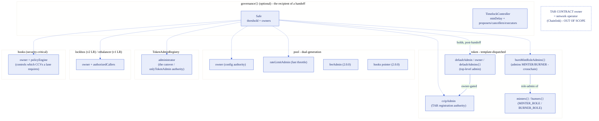
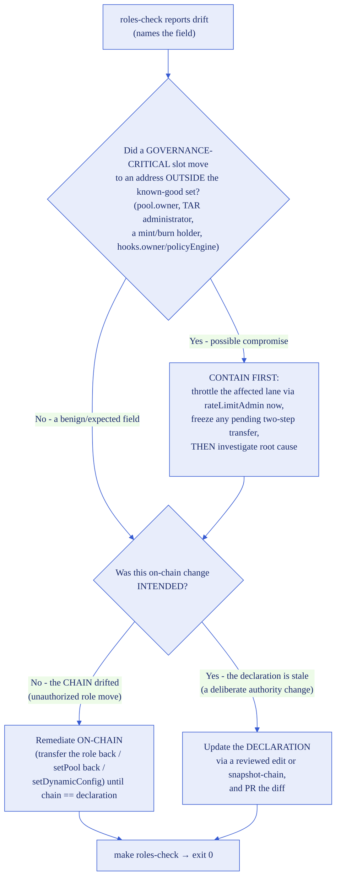
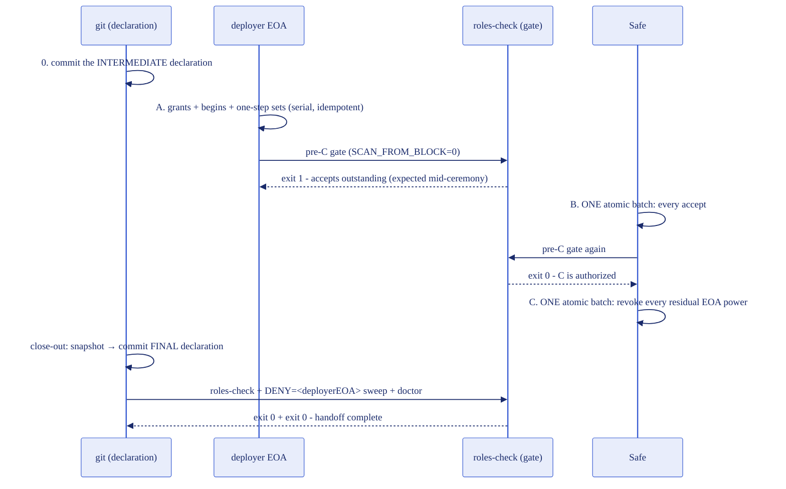

# Roles: the authority durable store and reconciliation

This deployment's **privileged authority** - who can mint, burn, re-point the pool, throttle a lane,
move liquidity, or change which verifiers a message requires - is declared in the `roles{}` subtree of
each chain's project store (`project/<selectorName>.json`), and reconciled against the live chain by
tooling. This doc makes the model operationally unambiguous: what the store is, which command reads
and which writes, what to do when they disagree, and exactly how much assurance a clean check gives.

For the field-by-field schema of `roles{}`, see
[`config-schema.md` → The `roles{}` subtree](./config-schema.md#the-roles-subtree---declared-authority-not-api-fact).
This document is the operator's runbook for the read-only reconcile engine (`RolesProbes` /
`RolesSnapshot` / `RolesAuditor`, `make snapshot-chain`, `make roles-check`, and the doctor's roles
rung), and for [the EOA → Safe handoff ceremony](#the-eoa--safe-handoff-ceremony)
(grant-new-before-revoke-old, the two-step accepts, revoke-last, and the completion gate).

## The mental model, stated plainly

- **`roles{}` in the project store is the DECLARED intent** - the authority the chain _should_ have. When
  a fork tracks `project/`, it is reviewed in a pull request, so a change to who controls the deployment is
  a diff a human approved.
- **The chain is reality** - who _actually_ holds each role right now.
- **"Reconcile" means DETECT divergence between the two and report it.** It is **not** an auto-fix:
  the tooling never moves a role. It tells you the declaration and the chain disagree, and names the
  field; you decide which side is wrong.

## The authority map



The reconcile engine reads every solid-outlined slot. The dashed **TAR contract owner** is the
network operator's authority (self-service registration via `RegistryModuleOwnerCustom`), deliberately
never read and never a FAIL.

## The two directions, and which one writes

| Command                            | Reads                        | Writes                                                      | Exit contract                                                 |
| ---------------------------------- | ---------------------------- | ----------------------------------------------------------- | ------------------------------------------------------------- |
| `make roles-check CHAIN=<name> [GROUP=<g>]`    | live chain + the declaration | **nothing**                                      | `0` clean / `1` drift (names the field) / `2` RPC unavailable |
| `make snapshot-chain CHAIN=<name> [GROUP=<g>]` | live chain                   | **only** the `.roles` subtree of that chain's project store | writes the declaration; canonicalizes the file    |

- **`make roles-check` is READ-ONLY.** It reads the live chain, compares to the declaration, prints one
  aligned `[PASS]`/`[FAIL]`/`[WARN]`/`[SKIP]` line per field, and exits `0`/`1`/`2`. It **never** writes
  a local file and never broadcasts. `make doctor CHAIN=<name>` runs the same auditor as its roles rung.
  (The `0/1/2` exit contract lives in `script/config/roles-check.sh`; GNU make remaps any recipe failure
  to `2`, so `make roles-check` is pass/fail only - **CI calls the script directly** for the real codes,
  the same pattern as `sync-check.sh`.)
- **`make snapshot-chain` is the ONLY writer.** It backfills the declaration FROM the chain
  (preserve-and-replace on the `.roles` subtree only), for the initial bootstrap or an intentional
  resync. Same no-silent-writeback rule as `lanes{}`: a read check never edits your files, and the one
  writer is an explicit, reviewed command.

Bootstrap a chain that has no `roles{}` yet:

```bash
make snapshot-chain CHAIN=ethereum-testnet-sepolia    # writes the .roles block from the live chain
git diff project/ethereum-testnet-sepolia.json        # review who holds what - the audit artifact (once a fork tracks project/)
make roles-check CHAIN=ethereum-testnet-sepolia        # should now report CLEAN (exit 0)
```

To prove a non-enumerable minter/burner list is complete (not just a candidate seed), run the event
scan. It marks the list `complete: true` only if the `eth_getLogs` scan succeeds over the range **and**
you pass a `fromBlock` at or before the token's deploy block (otherwise holders granted before
`fromBlock` and never re-touched are missed). The snapshot records the block it scanned from as
`scannedFromBlock` next to `complete`, so the completeness is legible as a proof _as of that block_:

```bash
SCAN_FROM_BLOCK=<token-deploy-block> make snapshot-chain CHAIN=ethereum-testnet-sepolia
```

A failed scan (an RPC that caps the `eth_getLogs` range) degrades to candidates with a logged SKIP and
`complete: false` - never a silently partial "complete" list. **`complete: true` is a point-in-time
proof, not a live invariant:** a grant made _after_ `scannedFromBlock`..snapshot is not reflected until
you re-snapshot (or run `roles-check` with `SCAN_FROM_BLOCK`, see the additive-detection note below).

## Token-group scope

A clone can hold several token groups, each in its own project-store directory (see
[`config-schema.md`](./config-schema.md#the-project-store---projectselectornamejson)). `GROUP=<g>` scopes an
authority command to one group's store (`project/<g>/<selectorName>.json`); unset is the flat default group,
with one deliberate exception for the read check:

- **`make snapshot-chain CHAIN=<name> GROUP=<g>`** and **`make doctor CHAIN=<name> GROUP=<g>`** each act on
  the one named group (unset = the default group).
- **`make roles-check GROUP=<g>`** scopes to that one group. With **`GROUP` unset and no chain argument
  it does not stop at the default group** - it reconciles the default group AND every `project/<group>/`
  subdirectory, prefixing each result line with `[group: <g>]` (the default group is labelled
  `[group: default]`), so a grouped token is never silently skipped. A run with an explicit
  `CHAIN=`/chain argument stays in the selected (or default) group - re-run per group to cover siblings.
- **`make roles-check-all`** sweeps every chain that declares `roles{}` across all token groups, under the
  same exit contract as `roles-check`.

## The drift-response runbook

When `make roles-check` reports **drift** (exit `1`, naming the exact field), **triage severity first,
then decide which side is wrong:**



- **(0) Containment first (severity triage).** Before deciding intended-vs-unintended, check _what_
  drifted. If `pool.owner`, `tokenAdminRegistry.administrator`, a mint/burn holder, or
  `hooks.owner`/`policyEngine` moved to an address outside your known-good set, treat it as a **potential
  compromise**: use the emergency-throttle authority (`rateLimitAdmin`, held on the Safe by convention -
  the auditor WARNs when it is not) to **throttle the affected lane immediately** and freeze any pending
  two-step transfer, _then_ root-cause. A rogue mint/burn or owner move is exfiltration risk; contain
  before you investigate.
- **(a) The CHAIN drifted** - an unauthorized role move. Remediate **on-chain** (transfer the role
  back, `setPool` back, a corrective `setDynamicConfig`, or re-run the handoff step) until the live chain
  matches the declared intent, then re-check. Keep the old known-good holder handy as the rollback target.
- **(b) The change was INTENDED** - a deliberate authority change (e.g. you moved a role to a new
  governance address on purpose). Update the **declaration** through a reviewed edit or
  `make snapshot-chain`, and PR the diff so the new intent is recorded and approved.

`make doctor`'s roles rung and the scheduled CI `roles-check` (in `.github/workflows/config-drift.yml`,
non-blocking) keep surfacing the drift as a `[FAIL]`/`::warning::` until it is reconciled one way or the
other. Reconciling means the two agree again - either the chain was fixed or the declaration was.

### `setDynamicConfig` router-preservation footgun

`rateLimitAdmin` and `feeAdmin` are both set through `setDynamicConfig(router, rateLimitAdmin,
feeAdmin)` - there is no standalone `setRateLimitAdmin` on 2.0.0. The setter **rewrites the pool's
router**, so any remediation that changes `rateLimitAdmin`/`feeAdmin` must **read the current router
live, pass it back unchanged, and assert it byte-identical pre and post.** Miss it and you silently
re-point the pool's router while "just" changing an admin. The handoff/remediation builders encode this
guard; when you remediate by hand, preserve the router explicitly.

## The honest-coverage caveat

**A CLEAN `roles-check` proves only what the engine can READ.** Read exactly this much assurance into a
green run, no more.

### The two failure directions are NOT covered equally

For a role-holder list, there are two ways it can be wrong, and the engine detects them very differently:

- **A declared holder was REVOKED** (someone you trusted lost the role): **always detected**, for every
  template - each declared holder is a direct `hasRole`/getter point-check.
- **An UNDECLARED holder was ADDED** (a rogue `MINTER_ROLE`/`DEFAULT_ADMIN_ROLE` grant): **detected only
  when the live set is knowable** -
  - `factory` and any `AccessControlEnumerable` token → **always** (two-sided set compare against the
    live enumeration);
  - `crosschain` / `burnmint` (non-enumerable) → **only when you run `roles-check` with
    `SCAN_FROM_BLOCK`** (an opt-in event-scan two-sided compare). Without it, the default reconcile
    verifies declared-holders-hold and **WARNs** that additive grants are unverified - it never
    reports a silent CLEAN over the gap, even when the list is `complete: true` (that completeness was
    proven at snapshot time, not now).

So: **a `crosschain`/`burnmint` CLEAN on a default (no-scan) run does not prove that no rogue mint/admin
grant exists.** For that assurance, run `SCAN_FROM_BLOCK=<deploy-block> make roles-check CHAIN=<name>`
on an RPC that serves the log range, which turns the additive check into a hard FAIL.

### Coverage by surface

- **Fully covered for any token** (CCIP-side authority, all direct getters, both directions): the
  TokenAdminRegistry `administrator`, the pool `owner` / `rateLimitAdmin` / `feeAdmin`, the lockbox
  `owner` / `authorizedCallers`, the hooks `owner` / `policyEngine`, the rebalancer (v1), and the token's
  admin-registration point - `token.owner()`, `getCCIPAdmin()`, or the AccessControl `DEFAULT_ADMIN_ROLE`
  (declared holders verified by `hasRole`). Governance-critical single-holder or enumerable slots read
  directly, never at the mercy of RPC log limits.
- **Token-internal multi-holder lists** (mint/burn, multi-holder default-admin): revoke always detected;
  additive detected per the direction rule above (enumerable always, non-enumerable only with
  `SCAN_FROM_BLOCK`).
- **NOT proven for a `byo` token**: a BYO token's token-internal mint/burn/admin rights are
  declaration-backed with `complete: false` and cannot be event-scanned (its deploy block is unknown to
  the engine). **A clean check does NOT prove a BYO token's mint/burn rights are safe** - only its
  universal admin points (`owner`/`ccipAdmin`/`DEFAULT_ADMIN_ROLE` point-checks) are verified.

## The snapshot forward-intent footgun

`make snapshot-chain` records an **already-executed** state: it backfills the declaration FROM the current
chain. It cannot express a change you _intend_ to make but have not executed yet. So if you are about to
move a role and want the declaration to lead the change (declare-then-execute), that first edit is a
**hand edit**, not a snapshot - running `snapshot-chain` before the on-chain move would silently overwrite
your forward-intent declaration back to the current (pre-change) chain state. Use `snapshot-chain` for the
initial bootstrap and for a _post-hoc_ resync after an intended change has landed on-chain; use a reviewed
hand edit when the declaration must precede the on-chain move.

## The EOA → Safe handoff ceremony

After setup, every privileged role moves from the deployer EOA to the Safe, **in the correct order**.
This repo ships building blocks, not an orchestrator: the ceremony is a documented sequence of
single-purpose primitives you compose - step A as serial EOA broadcasts, steps B and C as ONE atomic
Safe transaction each via
[`ExecuteBatch` composition](governance-modes.md#batching-multiple-operations-into-one-safe-transaction).
The ordering guarantees are properties of the role mechanisms (two-step accepts, grant-before-revoke),
and the proof lives in `test/governance/RolesHandoff.t.sol`, which drives the primitives in exactly
this order.

Two near-collision names, disambiguated once: **`TransferTokenAdmin`** (`script/setup/token-roles/`)
moves the token-INTERNAL top-level admin (template-dispatched), while the existing
**`TransferTokenAdminRole`** (`script/setup/`) moves the TokenAdminRegistry cutover authority. Both
appear in step A and they are not interchangeable. Note also that **`TransferOwnership`**
(`script/setup/transfer-ownership/`) handles pool, hooks, and lockbox owners only, never tokens.

| Task | Script |
| ---- | ------ |
| Move the token's internal top-level admin | `token-roles/TransferTokenAdmin` |
| Move the token's CCIP admin slot | `token-roles/SetCCIPAdmin` |
| Move the TokenAdminRegistry administrator | `setup/TransferTokenAdminRole` then `AcceptAdminRole` |
| Move a pool / hooks / lockbox owner | `transfer-ownership/TransferOwnership` then `AcceptOwnership` |

**Executor per step:**

| Step | Executor | Mechanism | Content |
| ---- | -------- | --------- | ------- |
| 0 | you (git) | reviewed hand edit | commit the INTERMEDIATE declaration (the forward intent) |
| A | the deployer EOA | serial `forge script --broadcast` runs (idempotent, safe to repeat) | every grant / begin / one-step set |
| gate | read-only | `SCAN_FROM_BLOCK=0 script/config/roles-check.sh <chain>` exit 0 | authorizes C |
| B | the Safe | ONE atomic `execTransaction` via `ExecuteBatch` | every two-step accept |
| C | the Safe | ONE atomic `execTransaction` via `ExecuteBatch` | every revoke of the deployer EOA |
| close-out | you (git) | `snapshot-chain` + reviewed commit | the FINAL EOA-free declaration + the `DENY` sweep |



The ceremony is **per token group**: thread the same group through every command - `PROJECT_GROUP=<g>`
on raw `forge script` and `roles-check.sh` runs, `GROUP=<g>` on the make verification steps (unset = the flat default group,
byte-identical behavior). A chain's handoff is complete only when the close-out passes for EVERY group
on that chain (a fresh clone's deployer EOA typically holds roles in all of them; the doctor's
grouped-sibling notice is the reminder).

### Step 0 - commit the intermediate declaration

Before anything executes, hand-edit the chain's `roles{}` (a reviewed edit of the pre-ceremony
snapshot - this is the forward-intent edit the
[snapshot footgun section](#the-snapshot-forward-intent-footgun) describes; do NOT run
`snapshot-chain` mid-ceremony, it would clobber this declaration back to the pre-change chain state)
to the state the chain must reach **before C**, in three parts:

1. **Single-holder / two-step slots** - token `defaultAdmin`, `ccipAdmin`, TAR `administrator` (with
   `pendingAdministrator: "0x0…0"` - the zero pending is code-enforced by the gate), pool
   `owner`/`rateLimitAdmin`/`feeAdmin`, lockbox/hooks `owner`, v1-LR `rebalancer`: declare the **Safe**.
2. **Enumerable membership lists** - lockbox/hooks `authorizedCallers`, factory minters/burners:
   declare the **live pre-C set INCLUDING the deployer EOA**. The EOA's removal from these sets IS
   batch C; a declaration that already excludes it can never pass before C runs.
3. **Non-enumerable admin lists** - burnmint `defaultAdmins`, crosschain `burnMintRoleAdmins`: declare
   **`[<Safe>]`, never omit them.** The auditor SKIPs an undeclared holder list, so omitting these
   lists would let the gate pass without proving the Safe's step-A grants landed - and batch C's
   revokes, which need those grants, would then revert the whole atomic C. Non-enumerable
   minters/burners: declare their final holders (the pool(s)).

Commit the edit (fork-tracking-`project/` repos; otherwise archive the file with your run evidence).
From here on, a `roles-check` field diff against this declaration is the ceremony's
progress meter and crash-resume pointer.

### Step A - the EOA grants (serial, idempotent, grant-only)

Simulate each command WITHOUT `--broadcast` first; broadcast only after the simulation's verify read
matches. Every A command is a grant/begin/set that is safe to re-run. `$SAFE` is the Safe address;
add `PROJECT_GROUP=<g>` to each line for a grouped token.

```bash
# 1. token top-level admin, template-dispatched (crosschain: beginDefaultAdminTransfer; burnmint:
#    grantRole(DEFAULT_ADMIN) - GRANT-ONLY, the old holder's revoke is batch C; factory: transferOwnership)
NEW_ADMIN=$SAFE forge script script/setup/token-roles/TransferTokenAdmin.s.sol --rpc-url $RPC --account $KEYSTORE_NAME --broadcast
# verify: cast call $TOKEN "pendingDefaultAdmin()(address,uint48)" - first value == $SAFE (crosschain; burnmint: hasRole(0x00,$SAFE) == true)

# 2. the slot a naive sweep forgets (crosschain only)
ROLE=burnMintAdmin HOLDER=$SAFE forge script script/setup/token-roles/GrantTokenRole.s.sol --rpc-url $RPC --account $KEYSTORE_NAME --broadcast
# verify: cast call $TOKEN "hasRole(bytes32,address)" $(cast call $TOKEN "BURN_MINT_ADMIN_ROLE()") $SAFE == true

# 3. CCIP admin (one-step - moves immediately; the EOA's DEFAULT_ADMIN_ROLE can still reverse it until C)
CCIP_ADMIN_ADDRESS=$SAFE forge script script/setup/token-roles/SetCCIPAdmin.s.sol --rpc-url $RPC --account $KEYSTORE_NAME --broadcast
# verify: cast call $TOKEN "getCCIPAdmin()" == $SAFE

# 4. TAR cutover authority (two-step; NOT the token-internal admin moved in step 1)
NEW_ADMIN=$SAFE forge script script/setup/TransferTokenAdminRole.s.sol --rpc-url $RPC --account $KEYSTORE_NAME --broadcast
# verify: TAR getTokenConfig(token).pendingAdministrator == $SAFE

# 5. pool ownership (two-step)
ADDRESS=$POOL NEW_OWNER=$SAFE forge script script/setup/transfer-ownership/TransferOwnership.s.sol --rpc-url $RPC --account $KEYSTORE_NAME --broadcast
# verify: owner() still the EOA (Chainlink Ownable2Step has NO pendingOwner getter - the accept in B is the proof)

# 6. rateLimitAdmin + feeAdmin (one-step; the script reads the live router and passes it back unchanged)
RATE_LIMIT_ADMIN=$SAFE FEE_ADMIN=$SAFE forge script script/configure/dynamic-config/SetDynamicConfig.s.sol --rpc-url $RPC --account $KEYSTORE_NAME --broadcast
# verify: getDynamicConfig() == (router UNCHANGED, $SAFE, $SAFE)

# 7-9. where present: lockbox owner, hooks owner (both generic Ownable legs of TransferOwnership, two-step),
#      and v1-LR REBALANCER=$SAFE via script/configure/liquidity/SetRebalancer.s.sol (one-step)
```

### The pre-C gate

```bash
SCAN_FROM_BLOCK=0 script/config/roles-check.sh <chain>     # caller-preset wins over .env - the scan stays OFF
echo $?   # must print 0 before C
```

Run it after A (expect exit 1 naming the outstanding accepts - that diff is normal mid-ceremony) and
again after B (must exit 0 - only then is C authorized). `SCAN_FROM_BLOCK` is pinned off because an
additive scan two-sided-compares and would FAIL on the residual EOA the intermediate declaration
deliberately tolerates; the gate's WARN advising a scan re-run is deferred to the post-C close-out.
The gate is the ONLY revoke-before-accept protection - the revoke primitives carry no pending checks.

The three Chainlink `Ownable2Step` slots (pool/lockbox/hooks) expose no `pendingOwner` getter, so the
auditor reads the pending owner **from storage**, self-checked: the contract must answer
`typeAndVersion()` and one of its first two storage slots must equal the live `owner()` - the other
slot is then the pending owner (the check covers both the `Ownable2Step` and the mirrored 1.5.0
`ConfirmedOwner` layout). After step A the gate output therefore SHOWS each in-flight transfer as a
`pendingOwner ... IN FLIGHT` WARN - verify it names the Safe before running B. A contract whose
layout fails the self-check is a visible SKIP (never a silently wrong read); for that case only, the
B-accept executing from the Safe remains the proof the pending pointed at the right address.

### Step B - the Safe accepts (one atomic batch)

Emit each accept as its own named batch (`MODE=safe`, distinct `BATCH_NAME`), then compose and execute
as ONE meta-transaction:

```bash
MODE=safe SAFE_ADDRESS=$SAFE BATCH_NAME=b-accept-token ACCEPT=1 forge script script/setup/token-roles/TransferTokenAdmin.s.sol --rpc-url $RPC
MODE=safe SAFE_ADDRESS=$SAFE BATCH_NAME=b-accept-tar forge script script/setup/AcceptAdminRole.s.sol --rpc-url $RPC
MODE=safe SAFE_ADDRESS=$SAFE BATCH_NAME=b-accept-pool ADDRESS=$POOL forge script script/setup/transfer-ownership/AcceptOwnership.s.sol --rpc-url $RPC
# (+ b-accept-lockbox / b-accept-hooks where present; burnmint tokens have NO accept leg - the step-A grantRole was already effective)
BATCH_NAME=handoff-b BATCH_FILES=batches/b-accept-token.$CHAIN_ID.json,batches/b-accept-tar.$CHAIN_ID.json,batches/b-accept-pool.$CHAIN_ID.json \
  SAFE_ADDRESS=$SAFE SAFE_EXEC=direct SAFE_SIGNER_KEYS=$OWNER_KEY_1,$OWNER_KEY_2 \
  forge script script/governance/ExecuteBatch.s.sol --rpc-url $RPC --account $KEYSTORE_NAME --broadcast
# verify: pool owner() == $SAFE, TAR administrator == $SAFE (pending 0x0), token defaultAdmin() == $SAFE
```

That single `execTransaction` succeeding is itself the proof the Safe can execute - established BEFORE
anything is revoked. Batches are regenerated per run; never reuse a stale `batches/` file.

### Step C - the Safe revokes (one atomic batch, LAST)

Only after the pre-C gate prints exit 0. Before submitting, run the
[independent-device safeTxHash verification](governance-modes.md#independent-signature-verification) -
C is the irreversible step, so the three-channel hash check is mandatory.

```bash
MODE=safe SAFE_ADDRESS=$SAFE BATCH_NAME=c-rv-mint ROLE=minter HOLDER=$DEPLOYER_EOA forge script script/setup/token-roles/RevokeTokenRole.s.sol --rpc-url $RPC
MODE=safe SAFE_ADDRESS=$SAFE BATCH_NAME=c-rv-burn ROLE=burner HOLDER=$DEPLOYER_EOA forge script script/setup/token-roles/RevokeTokenRole.s.sol --rpc-url $RPC
MODE=safe SAFE_ADDRESS=$SAFE BATCH_NAME=c-rv-bma ROLE=burnMintAdmin HOLDER=$DEPLOYER_EOA forge script script/setup/token-roles/RevokeTokenRole.s.sol --rpc-url $RPC
# burnmint template: ALSO revoke the EOA's DEFAULT_ADMIN_ROLE - the Safe keeps its own step-A grant:
# MODE=safe SAFE_ADDRESS=$SAFE BATCH_NAME=c-rv-da ROLE=defaultAdmin HOLDER=$DEPLOYER_EOA forge script script/setup/token-roles/RevokeTokenRole.s.sol --rpc-url $RPC
# (ROLE=defaultAdmin is burnmint-only: crosschain refuses it by name - its single-holder slot already
# moved via the two-step accept in B - and factory's top-level admin is the owner.)
# where present: remove the EOA from lockbox/hooks authorizedCallers (applyAuthorizedCallerUpdates).
BATCH_NAME=handoff-c BATCH_FILES=... SAFE_ADDRESS=$SAFE SAFE_EXEC=direct SAFE_SIGNER_KEYS=$OWNER_KEY_1,$OWNER_KEY_2 \
  forge script script/governance/ExecuteBatch.s.sol --rpc-url $RPC --account $KEYSTORE_NAME --broadcast
```

`RevokeTokenRole` requires `HOLDER=` explicitly - it has no default, because under `MODE=safe` the
executing-account default would be the Safe itself, i.e. revoking the recipient's fresh grant. The
ceremony never revokes anything from the Safe.

### Close-out - commit the final declaration and prove it

```bash
make snapshot-chain CHAIN=<chain> [GROUP=<g>]      # NOW the snapshot is safe - the intent is executed
git diff project/                                   # review: every holder == Safe, EOA gone from the sets
git commit ...                                      # the FINAL EOA-free declaration
script/config/roles-check.sh <chain>; echo $?       # exit 0
DENY=$DEPLOYER_EOA script/config/roles-check.sh <chain>; echo $?   # exit 0 - the completion proof
make doctor CHAIN=<chain> [GROUP=<g>]               # roles rung green
```

`roles-check` exit 0 alone cannot prove the EOA lost a NON-enumerable role (a residual `MINTER_ROLE`
is invisible to a declared-holders reconcile); the `DENY` sweep point-checks every privileged slot on
every contract in the store's `addresses{}` against the retired EOA - that second exit 0 is what
"handoff complete" means. Repeat per group: a chain-scoped `roles-check <chain>` run stays in ONE
group (`PROJECT_GROUP=<g>` selects it; unset = the default group), so the close-out runs once per
group - only the no-argument sweep crosses groups on its own. In this template repo `project/` is
gitignored, so the two `git` steps apply to a fork that tracks `project/`; without one, archive the
declaration files with your run evidence instead.

### Aborting before C

Everything up to batch C is reversible - that is what grant-before-revoke buys. To stand down a
half-done ceremony (wrong Safe, compromised signer, change of plan), undo in this order, then
re-commit the pre-ceremony declaration:

1. **Cancel the two-step pendings.** Crosschain token: `cancelDefaultAdminTransfer()` from the
   current default admin (still the EOA before B), or re-point it by re-running `TransferTokenAdmin`
   `NEW_ADMIN=<current admin>`. TAR / pool / lockbox / hooks: overwrite the pending by re-running the
   transfer primitive at the CURRENT holder, `TransferTokenAdminRole` `NEW_ADMIN=<current admin>` for
   the TAR, `TransferOwnership` `NEW_OWNER=<current owner>` for the Ownable2Step slots (a new
   `transferOwnership` replaces the pending; there is no cancel call).
2. **Reverse the one-step moves** (the EOA still holds each controlling parent before C):
   `SetCCIPAdmin` back to the EOA, `SetDynamicConfig` with the previous `rateLimitAdmin`/`feeAdmin`,
   `SetRebalancer` back where applicable.
3. **Revoke the Safe's step-A grants** - the ONE place a revoke aimed at the Safe is legitimate,
   which is why it is a manual action here and never a primitive default: `RevokeTokenRole`
   `ROLE=burnMintAdmin HOLDER=$SAFE` (crosschain) or `ROLE=defaultAdmin HOLDER=$SAFE` (burnmint),
   run by the EOA while it still holds the admin.
4. Run `roles-check` against the restored pre-ceremony declaration - exit 0 means the stand-down is
   complete; the `DENY=$SAFE` sweep then proves the Safe holds nothing.

**After B has executed, the accepts have landed and there is no abort** - the Safe holds the
two-step slots; "undoing" from there is a NEW handoff ceremony in the opposite direction, executed
by the Safe.

### Crashed mid-ceremony - resume

Run `script/config/roles-check.sh <chain>` (and `script/governance/VerifyRoles.s.sol` for the
at-a-glance table). The failing fields against the COMMITTED declaration are the resume pointer, and
**the direction of the diff matters**:

- **At every crash point up to and including C**, a diff means the chain is BEHIND the declaration -
  execute the named next step. Never re-run A after B's accepts landed (A's begins would re-open
  pendings); A steps individually are idempotent, B re-runs revert atomically with no state change.
- **The ONE exception is the window after C executed but before the final declaration is committed:**
  the still-committed INTERMEDIATE declaration now fails on exactly the enumerable EOA-membership rows
  - the chain moved PAST the declaration. The fix is to commit the final declaration; re-adding the
  EOA to the live sets to clear the diff would reopen exactly the hole C closed.

### Keeping it protected

A **fresh deploy regresses the ceremony**: `DeployToken` grants MINTER/BURNER (and the burn-mint
admin) to `ROLES_RECIPIENT`, which defaults to the deployer. After the handoff, deploy with
`ROLES_RECIPIENT=$SAFE`, and let the periodic `DENY=$DEPLOYER_EOA` sweep catch any slip - it
enumerates from `addresses{}` (active + deployments), so a freshly deployed, not-yet-snapshotted
token is in scope. Post-handoff, every owner-gated command runs `MODE=safe`
([governance-modes.md](governance-modes.md)).

The handoff needs no scheduled workflow of its own: the durable "handoff complete" check IS
`roles-check` exit 0 against the committed post-handoff `roles{}`. In this template repo the
scheduled drift run legitimately reconciles zero chains (`project/` is gitignored); a fork that
tracks `project/` gets the scheduled assertion for free.